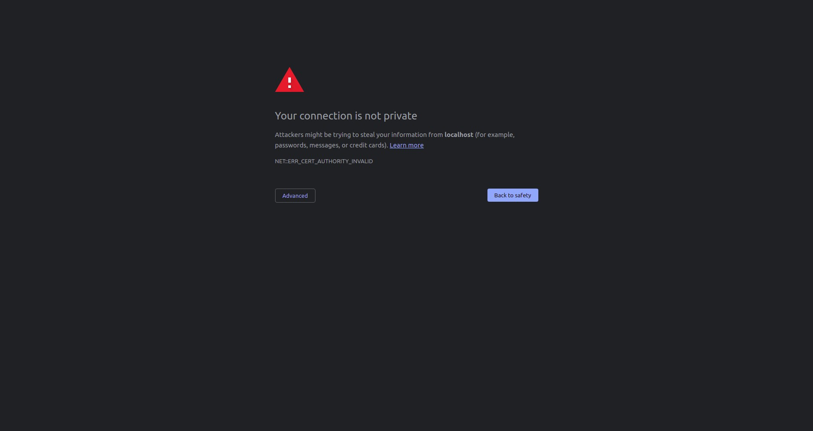
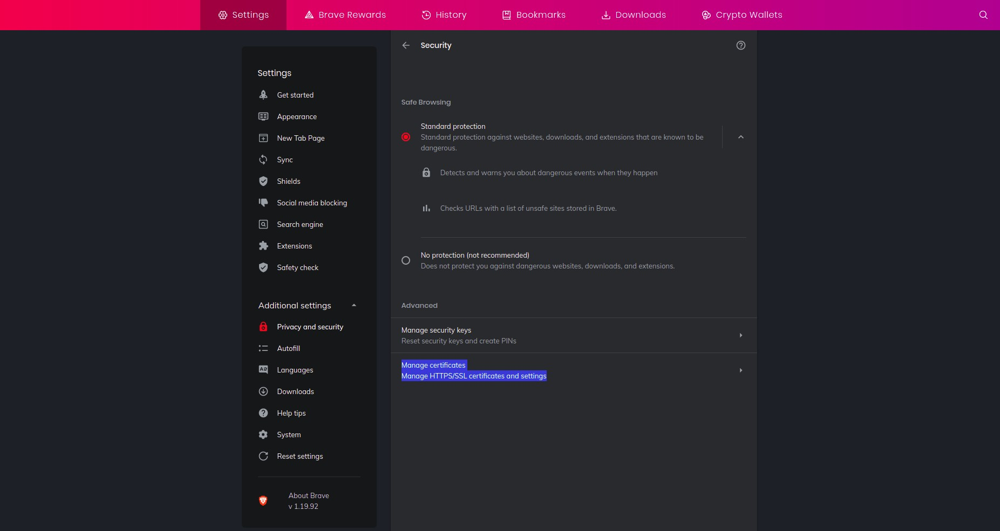

# Servers

Application that manages servers. Data are stored in relational database. Application has 3 profiles and use different database in each profile:
- dev - MYSQL 8.0.19
- test - POSTGRES 13
- prod - POSTGRES 13

Dockerfile contains two runtime stages: 
- **appServerRuntime**  - Spring Boot application server that provides REST API.
- **appWebServerRuntime** - Spring Boot application that provides REST API and contains Angular front-end [web application](https://github.com/DanijelRadakovic/Servers-Front)

[BuildKit](https://github.com/moby/buildkit) is used for building container images.

In order to build **appServerRuntime** image run the following command (Dockerfile has to be in current working direcotry and allowed values for stage are dev, test, prod):

```shell
DOCKER_BUILDKIT=1 docker build --target appServerRuntime --build-arg STAGE=dev -t danijelradakovic/servers:0.2.0 .
```

In order to build **appWebServerRuntime** image run the following command (Dockerfile has to be in current working direcotry and allowed values for stage are dev, test, prod):
```shell
DOCKER_BUILDKIT=1 docker build --target appWebServerRuntime --build-arg STAGE=dev -t danijelradakovic/servers:0.2.1 .
```

Building container images can also be achieved using docker compose. Before running any docker compose command you should always check configuration using the following command:
```shell
docker-compose --env-file config/.env.dev config
```

To setup an infrastructure for dev environment run the following command:
```shell
./start.sh -g dev
```

To setup an infrastructure for test environment run the fllowing command:
```shell
./start.sh -g test
```

To destroy an infrastructure for prod environment run the fllowing command:
```shell
./start.sh -g prod
```

To destroy an infrastructure for any environment run the following command:
```shell
docker-compose down -v
```

## Web Browser TLS Configuration
Without a proper configuration of web browser the following error shall occur.


In order to solve this error you should add generated self-signed certificate.

Go to security setting section and select Manage certificates options (image below shows security settings for Brave web browser).


Click on **Authorities** tab, then on **Import** option. Select the following certificate: **tls/ca/tls-ca-chain.pem**. Select all options in following dialog.


The CA certificates should be imported.


In order to authentificate to application, trusted client sertificate should be provided. Go to **Your certificates** section and click on **Import** option. Select the following certificate: **tls/certs/client/client.p12** and enter **password** in the following dialog.


Go to following site: https://localhost:8080 and select the trusted client sertificate for authentification.
